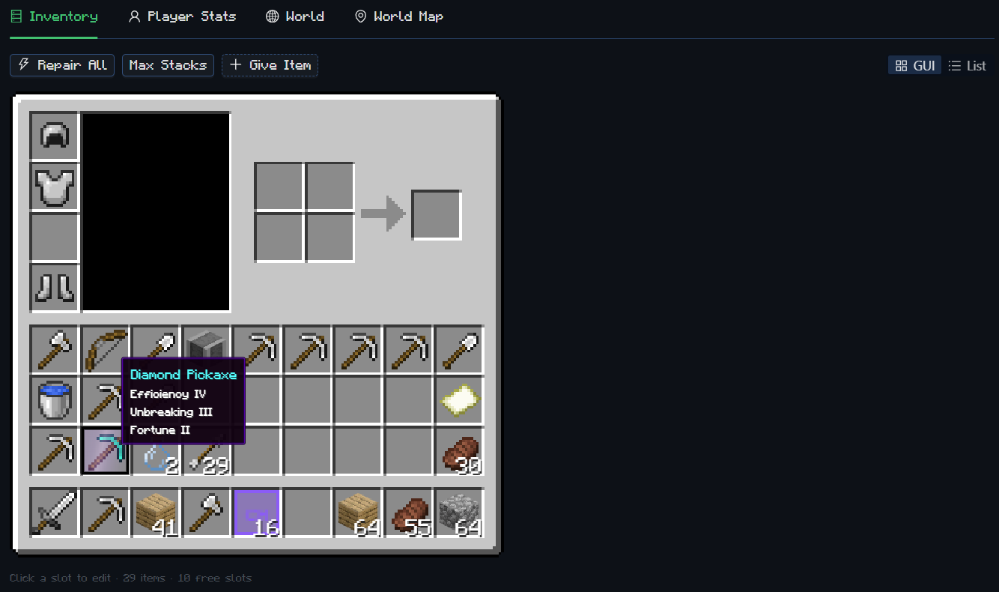
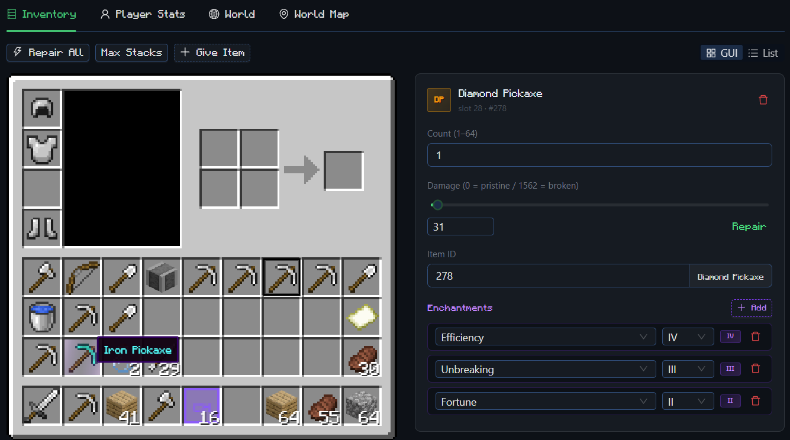
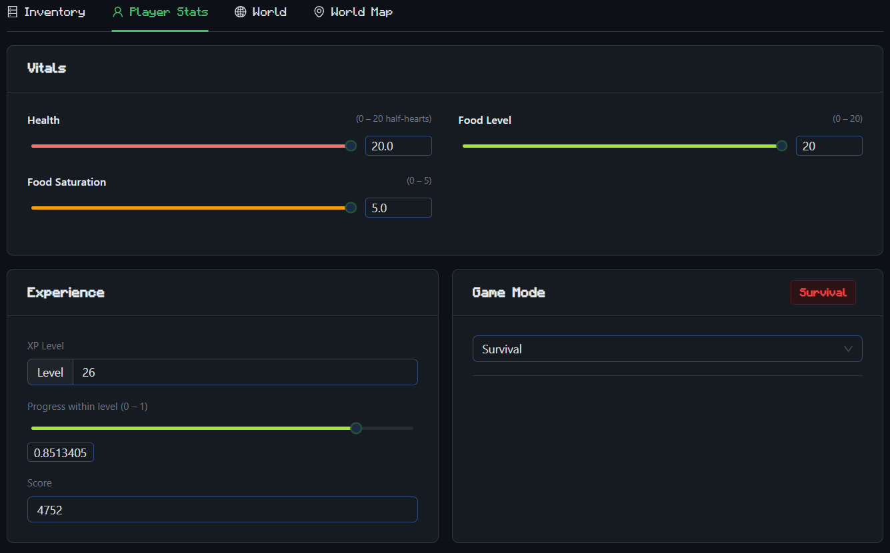
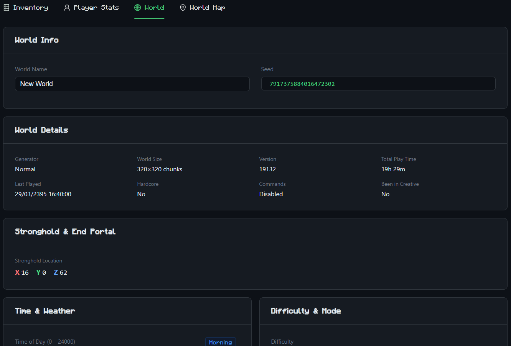
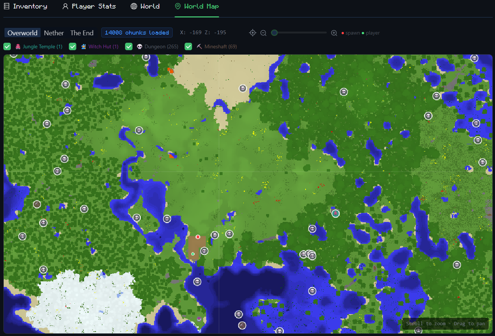

# lce save editor (fork)

a browser-based save editor for **minecraft legacy console edition** (TU19 / 1.6 era).
load a `.ms` save file or a plain player `.dat`, edit your inventory, player stats, and world settings, then download the modified save straight back to your machine — no install needed.

> this is a fork of [**lce-save-editor**](https://github.com/justinrest/lce-save-editor/tree/main) by [justinrest](https://github.com/justinrest).

---

## screenshots

| inventory | edit item |
|-----------|----------|
|  |  |

| player stats | world settings |
|-------------|----------------|
|  |  |

| world map |
|-----------|
|  |

---

## what this fork adds

compared to the original project, this fork adds:

- **interactive world map** — top-down block-level rendering of the overworld, nether, and end dimensions with pan, zoom, and coordinate display
- **structure detection** — villages, desert temples, jungle temples, witch huts, strongholds, and mineshafts are computed from the world seed and displayed as markers on the map
- **dungeon scanner** — mob spawner blocks are found by scanning chunk data, with entity type shown on hover (zombie, skeleton, spider); cave spider spawners (mineshafts) are filtered out
- **dimension switcher** — toggle between overworld, nether, and the end on the world map; nether rendering skips the bedrock ceiling to show the actual terrain below
- **per-structure toggles** — each structure type can be individually shown/hidden on the map
- **ender chest viewer** — displays the contents of the player's ender chest with item icons, enchantments, and quantities
- **active potion effects** — shows all status effects (speed, strength, regeneration, etc.) with amplifier level and remaining duration
- **world details** — generator type, world size, total play time, last played date, hardcore mode, commands, creative history
- **stronghold & end portal coordinates** — exact XYZ from level.dat, displayed in the world settings tab

---

## what it can do

### original features
- **inventory** — add, remove, or edit items; change stack count, damage, and enchantments; drag-and-drop slots; bulk repair or max stacks
- **player stats** — health, food, saturation, xp level, game mode, position, spawn point
- **world settings** — level name, seed, time of day, weather, difficulty, game rules
- supports `.ms` container saves (the native console format) and plain player `.dat` files

### added in this fork
- **world map** — interactive canvas-based top-down map with smooth zoom (0.25x–32x) and drag-to-pan
- **nether & end maps** — dimension selector with nether ceiling-aware rendering
- **structure markers** — seed-based computation for villages, temples, strongholds, mineshafts + block scanning for dungeons
- **ender chest** — read-only view of all 27 slots with item details
- **potion effects** — active status effects with duration countdown
- **world details card** — generator, world size, play time, last played, hardcore, commands
- **stronghold & end portal** — exact coordinates from level.dat

---

## how the .ms format works

the `.ms` file is a zlib-compressed container holding multiple embedded files (player dat, level.dat, etc.). see [`src/lib/containers.ts`](src/lib/containers.ts) for the full format breakdown and step-by-step read/write logic.

---

## source files

| file | purpose |
|------|---------|
| [`src/lib/containers.ts`](src/lib/containers.ts) | `.ms` container parser and rebuilder |
| [`src/lib/nbt.ts`](src/lib/nbt.ts) | binary nbt reader and writer |
| [`src/lib/items.ts`](src/lib/items.ts) | item id → name map and category helpers |
| [`src/lib/enchants.ts`](src/lib/enchants.ts) | enchantment definitions and labels |
| [`src/lib/texturePaths.ts`](src/lib/texturePaths.ts) | item/block id → CDN texture path map |
| [`src/lib/region.ts`](src/lib/region.ts) | region file (.mcr) parser, RLE decompressor, CompressedTileStorage decoder |
| [`src/lib/blockColors.ts`](src/lib/blockColors.ts) | block id → RGB color mapping for map rendering |
| [`src/lib/structures.ts`](src/lib/structures.ts) | structure placement algorithms (Java LCG, grid features, stronghold, mineshaft) |
| [`src/components/InventoryTab.tsx`](src/components/InventoryTab.tsx) | inventory editor (canvas + list view) |
| [`src/components/InventoryCanvas.tsx`](src/components/InventoryCanvas.tsx) | canvas-based inventory renderer with drag-and-drop and enchant glint |
| [`src/components/PlayerStatsTab.tsx`](src/components/PlayerStatsTab.tsx) | player stats editor + ender chest + potion effects |
| [`src/components/WorldTab.tsx`](src/components/WorldTab.tsx) | world settings editor + world details + stronghold coords |
| [`src/components/WorldMapTab.tsx`](src/components/WorldMapTab.tsx) | interactive world map with structure markers |
| [`src/components/FileDropZone.tsx`](src/components/FileDropZone.tsx) | drag-and-drop file loader |
| [`src/App.tsx`](src/App.tsx) | root app, file loading, tab layout |

---

## running locally

```bash
npm install
npm run dev
```

requires node 18+.

---

## notes

- all editing happens in-browser — nothing is sent to a server
- always back up your saves before editing
- tested against TU19 saves; other TU versions may work but aren't guaranteed
- game assets (textures, icons) are sourced from the [minecraft LCE source release](https://archive.org/details/minecraft-legacy-console-edition-source-code) via the internet archive
- minecraft is the property of mojang studios / microsoft — this is an unofficial fan tool